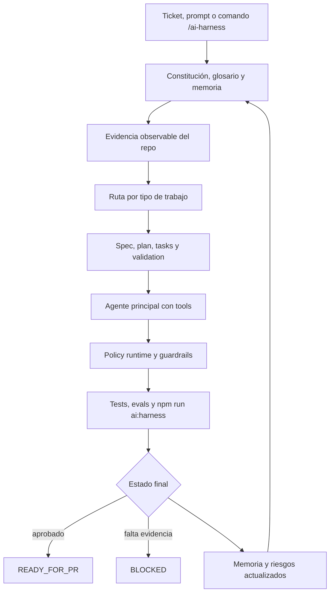

# AI Harness Template

Bienvenido al AI Harness Template: una base operativa para trabajar con IA sobre proyectos de software sin perder control, trazabilidad ni calidad técnica.

Este repositorio sirve como punto de partida para equipos que usan chats de editores como Windsurf, VS Code, Cursor, Codex u otros asistentes agentic. El template le da al agente una forma clara de investigar la codebase, crear specs, planear cambios, implementar con tests, actualizar memoria y preparar entrega por CI/CD.

Guía inicial para operar proyectos de software con IA usando evidencia, SDD/spec-kit, agentes con herramientas, guardrails, memoria, evaluaciones automáticas y promoción por Harness.io o CI.

Este template funciona sin dependencias externas y puede envolver proyectos Node/TypeScript, Python, Java, .NET u otro stack. La política central vive en `CONSTITUTION.md`; el vocabulario operativo vive en `ai-engineering/GLOSSARY.md`.

## Propuesta de valor

Los equipos ya usan asistentes de IA para programar, revisar y documentar, pero normalmente lo hacen con prompts sueltos, contexto incompleto y criterios de entrega poco verificables. AI Harness Template resuelve ese problema convirtiendo el uso de IA en un flujo de ingeniería gobernado: evidencia antes de diseño, specs antes de cambios grandes, tests antes de entrega y memoria persistente para no empezar desde cero en cada conversación.

Está hecho para equipos de software que quieren adoptar IA sobre repositorios reales sin perder control técnico: tech leads, squads de producto, plataformas internas, consultoras, equipos enterprise y developers que operan con chats de editor o agentes con herramientas.

Lo distinto no es otro wrapper, SDK o prompt mágico. Es una capa operativa completa que combina constitución, glosario, memoria, rutas por tipo de trabajo, policy runtime, SDD/spec-kit, evaluaciones y CI/CD. Al adoptarlo, un equipo obtiene un modo repetible de convertir tickets o conversaciones en cambios trazables con estado final claro: `READY_FOR_PR` o `BLOCKED`.

Antes de entregar cualquier cambio, el flujo debe pasar por el [Checklist antes de entregar](#checklist-antes-de-entregar): objetivo, evidencia, arquitectura afectada, pruebas, seguridad, memoria, riesgos y resultado final.

## Índice

1. [Qué es este template](#qué-es-este-template)
2. [Qué lo diferencia](#qué-lo-diferencia)
3. [Perfil ideal de usuario](#perfil-ideal-de-usuario)
4. [Mini arquitectura del template](#mini-arquitectura-del-template)
5. [Estado del proyecto](#estado-del-proyecto)
6. [Pendiente por adopción](#pendiente-por-adopción)
7. [Cuándo usarlo](#cuándo-usarlo)
8. [Qué incluye](#qué-incluye)
9. [Inicio rápido](#inicio-rápido)
10. [Cómo usar este template en un proyecto](#cómo-usar-este-template-en-un-proyecto)
11. [Uso desde chats de editores](#uso-desde-chats-de-editores)
12. [Prompts iniciales recomendados](#prompts-iniciales-recomendados)
13. [Ejemplo de entrada](#ejemplo-de-entrada)
14. [Cómo usarlo paso a paso](#cómo-usarlo-paso-a-paso)
15. [Flujos disponibles](#flujos-disponibles)
16. [Ejemplos por flujo](#ejemplos-por-flujo)
17. [Estructura recomendada de specs](#estructura-recomendada-de-specs)
18. [Perfil Node.js](#perfil-nodejs)
19. [Perfil .NET y Azure DevOps](#perfil-net-y-azure-devops)
20. [Checklist antes de entregar](#checklist-antes-de-entregar)
21. [Comandos útiles](#comandos-útiles)
22. [Principios de diseño](#principios-de-diseño)

## Qué es este template

Un AI harness es una capa de control para trabajar con IA sobre una codebase. Combina:

- prompts versionados;
- memoria del proyecto;
- specs y planes SDD/spec-kit;
- políticas determinísticas;
- guardrails de herramientas y audiencias;
- evaluaciones automáticas;
- pipelines CI/CD;
- checklist end-to-end.

La idea principal es simple: primero evidencia, después diseño; primero agente principal, después subagentes solo si existe una razón real.

## Qué lo diferencia

AI Harness Template no intenta reemplazar tu editor, tu CI ni tu framework. Los coordina para que el trabajo con IA sea auditable y repetible.

- **No es solo un prompt**: incluye reglas versionadas, memoria, plantillas, evaluaciones, policy runtime y pipelines.
- **No es un SDK de IA**: no obliga a reescribir el producto ni agrega runtime productivo; opera alrededor de la codebase.
- **No es un wrapper de agentes**: define cuándo usar agente principal, tools, subagentes, specs, aprobaciones y gates.
- **No depende de un stack único**: puede envolver proyectos Node.js, .NET, Java, Python, frontend, backend o monorepos.
- **No entrega por intuición**: exige evidencia, validación, riesgos residuales y un estado final explícito.

El diferencial práctico es que convierte una conversación con IA en un proceso de delivery: entrada, evidencia, ruta, spec, implementación, tests, revisión, memoria y entrega.

## Perfil ideal de usuario

Este template encaja especialmente bien si tu equipo:

- ya usa chats de editor o agentes para programar y revisar código;
- trabaja sobre repositorios reales con deuda, historia y reglas de negocio;
- necesita trazabilidad entre ticket, decisión técnica, tests y entrega;
- quiere adoptar IA sin dejar decisiones críticas solo en lenguaje natural;
- tiene CI/CD o busca llevar el flujo hacia GitHub Actions, Azure DevOps o Harness.io;
- quiere estandarizar cómo se pide, valida y entrega trabajo asistido por IA.

Puede ser demasiado formal para scripts personales o prototipos descartables. Brilla más cuando hay más de una persona, más de un cambio y necesidad de repetir el proceso con confianza.

## Mini arquitectura del template



La arquitectura completa por capas vive en `ai-engineering/TEMPLATE_LAYERS_AND_DIAGRAMS.md`.

## Estado del proyecto

Estado actual: **MVP operativo**.

Ya incluye template inicial, constitución, glosario, memoria, prompts, skills, rutas SDLC, command routing, policy runtime, tests nativos, harness automático, GitHub Actions, Harness.io pipeline, Azure DevOps pipeline condicional por stack, perfiles Node.js/.NET y plantillas de adopción para audiencias, tools, integraciones y observabilidad.

La verificación base se ejecuta con:

```bash
npm run ai:harness
npm test
npm run test:native
npm run test:all
```

El estado vivo del template se mantiene en `ai-engineering/state/implementation-status.md`.

## Pendiente por adopción

El template deja listas las piezas base. En cada proyecto real todavía debes completar:

- audiencias con roles, permisos y aprobaciones del dominio;
- tools reales conectadas al producto o plataforma del equipo;
- dashboards con métricas de CI, PRs, tickets y evidencia;
- integraciones Jira, Confluence, Slack/Teams u otras fuentes operativas;
- ambientes Harness.io, approvals y secrets específicos;
- evals con casos propios del dominio.

## Cuándo usarlo

Usa este template cuando quieras que un asistente de IA trabaje sobre un repositorio real con disciplina de ingeniería:

- adoptar un proyecto existente y generar memoria técnica inicial;
- implementar features con specs, plan, tasks y validación;
- corregir bugs con reproducción o evidencia clara;
- preparar hotfixes con aprobación humana;
- hacer refactors preservando comportamiento;
- investigar decisiones técnicas sin mezclar investigación con implementación;
- estandarizar prompts para chats de editores y herramientas agentic.

No está pensado como un framework de runtime de producción. Es una capa de operación, documentación, guardrails y evaluación para el ciclo de desarrollo asistido por IA.

## Qué incluye

- `ai-engineering/` - specs, evaluaciones, memoria, observabilidad, estado, plantillas y términos clave.
- `ai-engineering/GLOSSARY.md` - vocabulario común para humanos, agentes LLM y pipelines.
- `ai-engineering/profiles/nodejs.md` - perfil para proyectos Node.js, JavaScript, TypeScript, frontend, backend y monorepos.
- `ai-engineering/profiles/dotnet.md` - perfil para soluciones .NET, Azure DevOps, code review, SOLID y Clean Architecture pragmática.
- `ai-engineering/audiences/` - plantilla para roles, permisos, approvals y expectativas de entrega por audiencia.
- `ai-engineering/tools/` - manifiesto base para declarar tools reales y sus permisos.
- `ai-engineering/integrations/` - checklist de adopción para Jira/Azure Boards, Confluence, Slack/Teams y Harness.io.
- `ai-engineering/observability/` - guía y plantilla para dashboards de delivery asistido por IA.
- `ai-engineering/workflows/` - workflow SDLC asistido por IA y rutas por tipo de trabajo.
- `ai-engineering/spec-kit/` - integración con GitHub Spec Kit y fallback SDD simple.
- `prompts/` - prompts versionados para agentes de software.
- `prompts/EDITOR_CHAT_COMMANDS.md` - entradas estándar `/ai-harness ...` para chats de editores.
- `skills/` - skills locales reutilizables.
- `src/` - núcleo mínimo de policy/tool routing en JavaScript.
- `tests/` - evaluation harness con `node --test`.
- `CONSTITUTION.md` - reglas obligatorias de evidencia, memoria, simplicidad agentic, antipatterns, performance, cobertura de pruebas y definición de done.
- `.github/workflows/ai-harness.yml` - CI para PRs.
- `.harness/ai-harness-pipeline.yaml` - pipeline base para Harness.io.
- `azure-pipelines.yml` - pipeline base para Azure DevOps con pasos Node/.NET condicionales por señales del repo.

## Inicio rápido

```bash
npm run ai:harness
npm test
npm run test:native
npm run test:all
```

`npm run ai:harness` y `npm test` ejecutan el runner determinístico definido en `scripts/run-harness.js`. `npm run test:native` ejecuta la suite `node --test`; `npm run test:all` corre ambas verificaciones.

## Cómo usar este template en un proyecto

1. Copia este template dentro del repositorio que quieres operar o úsalo como base de un nuevo repo.
2. Abre el proyecto en tu editor con IA: Windsurf, VS Code, Cursor, Codex o similar.
3. Pide al agente que lea primero `CONSTITUTION.md`, `ai-engineering/GLOSSARY.md` y `prompts/EDITOR_CHAT_COMMANDS.md`.
4. Ejecuta un análisis inicial con `/ai-harness analyze` o adopta el repo con `/ai-harness adopt`.
5. Completa la memoria mínima en `ai-engineering/memory/` con contexto real del proyecto.
6. Para cada cambio, inicia con un tipo de trabajo: `feature`, `bugfix`, `hotfix`, `refactor`, `spike` o `chore`.
7. Antes de implementar, exige decisión unificada del harness: ruta, spec provider, stack profiles aplicables, documentación mínima, gates y aprobación humana si aplica.
8. Al terminar, ejecuta `npm run ai:harness` y los tests propios del stack.

El template no reemplaza las prácticas del equipo. Las hace explícitas para que el agente pueda seguirlas de forma consistente.

## Uso desde chats de editores

En chats de editores, usa entradas cortas y repetibles. La forma recomendada es:

```text
/ai-harness <tipo-de-trabajo> <ticket-id>

Contexto:
<descripcion breve del problema>

Criterios:
- <criterio verificable>
- <criterio verificable>

Restricciones:
- <limite tecnico o de negocio>
```

Tipos de trabajo disponibles:

- `feature` - nueva capacidad funcional.
- `bugfix` - corrección acotada.
- `hotfix` - corrección urgente con aprobación humana.
- `refactor` - mejora interna sin cambiar comportamiento esperado.
- `spike` - investigación sin implementación productiva.
- `chore` - documentación, configuración o mantenimiento.

El archivo `prompts/EDITOR_CHAT_COMMANDS.md` contiene la lista completa de comandos, alias y formato final esperado.

## Prompts iniciales recomendados

### 1. Analizar un repositorio por primera vez

```text
/ai-harness analyze

Lee CONSTITUTION.md, ai-engineering/GLOSSARY.md y la memoria disponible.
Analiza esta codebase con evidencia observable.
No implementes cambios.
Entrega arquitectura observada, flujos principales, riesgos, oportunidades reales para IA y un plan de arranque.
```

### 2. Adoptar un proyecto existente

```text
/ai-harness adopt

Adapta este AI harness al repositorio actual.
Detecta stack, runtime, package manager, tests, CI/CD, estructura del proyecto y memoria faltante.
Propón la integración mínima reversible.
No instales dependencias ni cambies archivos sin explicar primero el plan.
```

### 3. Crear una feature con spec

```text
/ai-harness feature PROJ-123

Contexto:
Necesitamos permitir que clientes consulten el estado de una solicitud.

Criterios:
- El cliente solo puede consultar sus propias solicitudes.
- La respuesta debe incluir estado, próxima acción y explicación simple.
- No debe exponer PII cruda.
- Deben existir tests de autorización y caso no encontrado.

Restricciones:
- No cambiar el modelo de datos.
- Mantener reglas críticas en código determinístico.
```

### 4. Corregir un bug

```text
/ai-harness bugfix PROJ-456

Contexto:
Los casos cerrados aparecen como pendientes en el endpoint de consulta.

Criterios:
- Reproducir o explicar el fallo con evidencia.
- Corregir la causa, no solo el síntoma.
- Agregar regression test.
- Documentar riesgo residual si algún path no puede probarse.
```

### 5. Investigar antes de decidir

```text
/ai-harness spike PROJ-654

Contexto:
Queremos evaluar si conviene usar subagentes para revisión de seguridad.

Preguntas:
- Qué riesgo reduce realmente.
- Qué costo de contexto agrega.
- Qué permisos o fronteras justificarían subagentes.
- Cuál es la recomendación final.

No implementes cambios productivos.
```

### 6. Preparar revisión antes de PR

```text
/ai-harness review

Revisa el cambio actual contra CONSTITUTION.md, specs, tests, memoria, performance, seguridad y riesgos.
Prioriza bugs, regresiones, falta de tests y problemas que bloqueen READY_FOR_PR.
Entrega hallazgos con archivo, línea, severidad y recomendación.
```

### 7. Preparar release o entrega

```text
/ai-harness release

Valida build, tests, npm run ai:harness, memoria, riesgos residuales, approvals y estado final.
Entrega STATUS: READY_FOR_PR o BLOCKED con evidencia.
```

## Ejemplo de entrada

Puedes iniciar un trabajo con una entrada corta:

```text
feature PROJ-123
```

Desde un chat de editor también puedes usar:

```text
/ai-harness feature PROJ-123
```

Ejemplo con más contexto:

```text
feature PROJ-123

Título: Permitir que clientes consulten el estado de una solicitud.
Objetivo: Crear un endpoint o tool que devuelva estado, próximas acciones y explicación simple.
Criterios de aceptación:
- El cliente solo puede consultar sus propios casos.
- La respuesta no debe exponer PII cruda.
- Debe existir test de autorización y test de caso no encontrado.
Restricciones:
- No cambiar el modelo de datos.
- Mantener decisiones críticas en política determinística.
```

El orquestador debe cargar `CONSTITUTION.md`, `ai-engineering/GLOSSARY.md`, memoria relevante y evidencia del repositorio antes de proponer implementación.

Las entradas estándar para editores viven en `prompts/EDITOR_CHAT_COMMANDS.md`.

## Cómo usarlo paso a paso

1. Lee `CONSTITUTION.md` para entender reglas obligatorias.
2. Lee `ai-engineering/GLOSSARY.md` para usar los mismos términos que el harness.
3. Si el stack es Node.js, lee `ai-engineering/profiles/nodejs.md`; si es .NET, lee `ai-engineering/profiles/dotnet.md`.
4. Crea o actualiza una spec en `ai-engineering/specs/`.
5. Completa memoria mínima en `ai-engineering/memory/`.
6. Elige el tipo de trabajo: `feature`, `bugfix`, `hotfix`, `refactor`, `spike` o `chore`.
7. Revisa la ruta en `ai-engineering/workflows/workflow-routes.json`.
8. Genera una decisión unificada del harness: ruta, provider de spec, stack profiles aplicables, task decomposition, modo de ejecución y gates.
9. Decide si el trabajo requiere descomposición en tareas o subtareas antes de implementar.
10. Detecta GitHub Spec Kit; si no existe, sugiere instalación y usa fallback SDD simple si el usuario no instala.
11. Ajusta prompts, tools y audiencias si el dominio lo requiere.
12. Agrega o actualiza tests y evaluaciones.
13. Ejecuta `npm run ai:harness`.
14. Promueve por Azure DevOps, GitHub Actions o Harness.io cuando el checklist esté completo.

## Flujos disponibles

| Entrada | Ruta | Uso | Specs | Tests | Aprobación humana |
| --- | --- | --- | --- | --- | --- |
| `feature PROJ-123` | `full_sdd` | Nueva capacidad o cambio funcional relevante. | Completa con tareas | Unit, regression, integration/contract si aplica | No por defecto |
| `bugfix PROJ-456` | `focused_fix` | Corrección acotada con comportamiento esperado claro. | Ligera; tareas si es mediana/grande | Regression y error path si aplica | No por defecto |
| `hotfix PROJ-789` | `emergency_fix` | Corrección urgente con riesgo productivo. | Incident note; tareas mínimas si es grande | Smoke y regression cuando sea posible | Sí |
| `refactor PROJ-321` | `architecture_safe_change` | Mejora interna preservando comportamiento. | Completa con tareas | Regression y contract si cambia frontera | No por defecto |
| `spike PROJ-654` | `research_only` | Investigación sin implementación productiva. | Research brief con preguntas si es mediana/grande | No requerido | No por defecto |
| `chore PROJ-987` | `maintenance` | Mantenimiento, docs, configuración o tareas menores. | Ligera; tareas opcionales | Solo si cambia comportamiento | No por defecto |

## Ejemplos por flujo

### Feature

Entrada:

```text
feature PROJ-123
Crear tool para consultar estado de caso por cliente.
```

Uso esperado:

- crear spec completa;
- mapear evidencia del repositorio;
- definir plan y tasks;
- implementar cambio mínimo;
- agregar tests;
- actualizar memoria;
- dejar salida `READY_FOR_PR` o `BLOCKED`.

### Bugfix

Entrada:

```text
bugfix PROJ-456
El estado de casos cerrados aparece como pendiente.
```

Uso esperado:

- reproducir o explicar el fallo;
- localizar flujo afectado;
- crear spec ligera;
- corregir la causa;
- agregar regression test;
- documentar riesgo residual.

### Hotfix

Entrada:

```text
hotfix PROJ-789
Bloquear ejecución de workflow no aprobado en producción.
```

Uso esperado:

- crear incident note;
- aplicar el cambio más pequeño y seguro;
- ejecutar smoke/regression;
- pedir aprobación humana antes de promover;
- registrar evidencia de release.

### Refactor

Entrada:

```text
refactor PROJ-321
Separar policy determinística de lógica de presentación.
```

Uso esperado:

- demostrar comportamiento actual con tests;
- planear pasos pequeños;
- preservar contratos públicos;
- revisar performance y acoplamiento;
- actualizar decisiones arquitectónicas si aplica.

### Spike

Entrada:

```text
spike PROJ-654
Investigar si conviene usar subagentes para revisión de seguridad.
```

Uso esperado:

- investigar con evidencia;
- listar opciones;
- comparar costo, riesgo y contexto;
- recomendar una sola opción;
- no entregar cambios productivos salvo pedido explícito.

### Chore

Entrada:

```text
chore PROJ-987
Actualizar documentación de tools disponibles por audiencia.
```

Uso esperado:

- confirmar que no cambia comportamiento;
- actualizar docs o configuración;
- ejecutar harness;
- actualizar memoria si cambia el modo de operación.

## Estructura recomendada de specs

Para trabajos completos, usa:

```text
ai-engineering/specs/<ticket-id>/
  spec.md
  plan.md
  tasks.md
  evidence.md
  validation.md
```

Contenido mínimo:

- `spec.md` - problema, requisitos, criterios de aceptación, restricciones y definición de done.
- `plan.md` - arquitectura observada, archivos esperados, estrategia, tests, performance y rollback.
- `tasks.md` - tareas pequeñas, estado y evidencia esperada.
- `evidence.md` - hechos observados, inferencias, hipótesis y dependencias críticas de contexto.
- `validation.md` - comandos ejecutados, resultados, riesgos residuales y checklist end-to-end.

Estos artefactos son la documentación mínima del harness. Si se usa GitHub Spec Kit, el provider puede generar parte del flujo, pero el harness conserva la obligación de registrar evidencia, validación, riesgos y memoria.

## Perfil Node.js

Para proyectos Node.js, JavaScript o TypeScript, usar `ai-engineering/profiles/nodejs.md` como guía obligatoria del stack. El perfil define:

- señales para detectar `package.json`, lockfiles, workspaces, frontend, backend y monorepos;
- comandos por package manager: `npm`, `pnpm`, `yarn` y `bun`;
- gates recomendados: install reproducible, lint, typecheck, tests, build, e2e y auditoría de dependencias cuando aplique;
- reglas para TypeScript, frontend/fullstack, backend/APIs/jobs, seguridad, dependencias y performance;
- code review obligatorio antes de `READY_FOR_PR`;
- prohibiciones explícitas para evitar lockfile churn, dependencias innecesarias, relajación de tipos, filtración de secretos/PII y bloqueo del event loop.

Ejemplo de entrada Node.js:

```text
bugfix PROJ-456
El endpoint POST /cases permite crear solicitudes sin email válido.

Stack: Node.js API con TypeScript y Vitest.
Criterios:
- Reproducir fallo con regression test.
- Validar entrada antes de ejecutar reglas de negocio.
- No exponer PII cruda ni stack traces.
- Ejecutar npm run typecheck, npm test y npm run build si existen.
```

Gates mínimos Node.js:

- [ ] package manager detectado por lockfile;
- [ ] instalación reproducible cuando aplique: `npm ci`, `pnpm install --frozen-lockfile`, `yarn install --frozen-lockfile` o `bun install --frozen-lockfile`;
- [ ] lint ejecutado cuando exista;
- [ ] typecheck ejecutado cuando exista TypeScript;
- [ ] tests relevantes ejecutados;
- [ ] build ejecutado cuando exista;
- [ ] e2e ejecutado cuando el cambio toque flujo cubierto por e2e;
- [ ] dependencias y lockfile revisados si cambiaron;
- [ ] code review aprobado;
- [ ] aprobación humana para hotfix, producción, datos sensibles, migraciones o cambios de contrato público.

## Perfil .NET y Azure DevOps

Para proyectos .NET, usar `ai-engineering/profiles/dotnet.md` como guía obligatoria del stack. El perfil define:

- señales para detectar soluciones `.sln`, `.slnx` y proyectos `.csproj`;
- comandos recomendados: `dotnet restore`, `dotnet build`, `dotnet test`, cobertura y `dotnet format`;
- integración con Azure DevOps Work Items, Pull Requests, branch policies y build validation;
- code review obligatorio antes de `READY_FOR_PR`;
- aplicación simple de SOLID y Clean Architecture cuando sea aplicable;
- prohibiciones explícitas para evitar deuda, inseguridad y falsos positivos de entrega.

Ejemplo de entrada .NET:

```text
bugfix AZDO-456
El endpoint GET /cases/{id}/status devuelve Pending para casos cerrados.

Stack: ASP.NET Core API con Clean Architecture.
Criterios:
- Reproducir fallo con regression test.
- Mantener regla de estado en Application o Domain.
- Ejecutar dotnet build y dotnet test.
- Pasar code review antes de READY_FOR_PR.
```

Gates mínimos .NET:

- [ ] `dotnet restore`
- [ ] `dotnet build --configuration Release`
- [ ] `dotnet test --configuration Release`
- [ ] cobertura publicada cuando esté configurada;
- [ ] code review aprobado;
- [ ] Azure DevOps PR vinculado a Work Item;
- [ ] aprobación humana para hotfix, producción, datos sensibles o migraciones.

## Checklist antes de entregar

- [ ] Objetivo del cambio definido.
- [ ] Evidencia observable registrada.
- [ ] Arquitectura afectada entendida.
- [ ] Antipatterns nuevos descartados.
- [ ] Impacto de performance evaluado.
- [ ] Cobertura de pruebas acorde a criticidad.
- [ ] Caminos de error importantes cubiertos.
- [ ] Datos sensibles protegidos.
- [ ] Code review completado cuando aplique.
- [ ] Perfil de stack aplicado cuando exista, por ejemplo Node.js o `.NET`.
- [ ] Memoria y estado actualizados.
- [ ] Riesgos residuales documentados.
- [ ] `npm run ai:harness` ejecutado.
- [ ] Resultado final: `READY_FOR_PR` o `BLOCKED`.

## Comandos útiles

```bash
npm run ai:harness
```

Ejecuta el harness determinístico del template.

```bash
npm test
```

Alias local de `npm run ai:harness`.

```bash
npm run test:native
```

Ejecuta los tests nativos en `tests/`.

```bash
npm run test:all
```

Ejecuta harness y suite nativa. Es la verificación más completa cuando el entorno permite `node --test`.

## Principios de diseño

- La IA puede planificar, implementar, soportar, explicar y orquestar herramientas.
- Las decisiones críticas del negocio deben vivir en código determinístico, políticas versionadas y evaluaciones automáticas.
- Los prompts deben decir cómo actuar; la memoria debe decir qué se sabe del sistema.
- La ruta default es un agente principal con herramientas y memoria externa.
- Los subagentes se justifican solo por riesgo, permisos, contexto o fronteras reales de dominio.
- En Node.js, package manager, lockfile, typecheck, tests, build y seguridad de dependencias deben tratarse como gates del cambio cuando apliquen.
- En .NET, SOLID y Clean Architecture deben prevalecer de forma simple cuando sean aplicables, sin crear abstracciones innecesarias.
