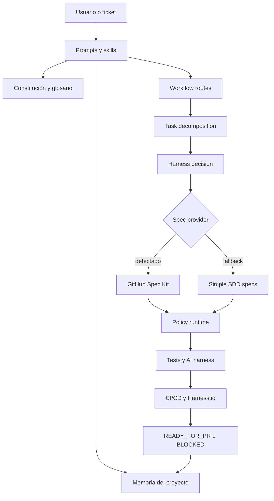
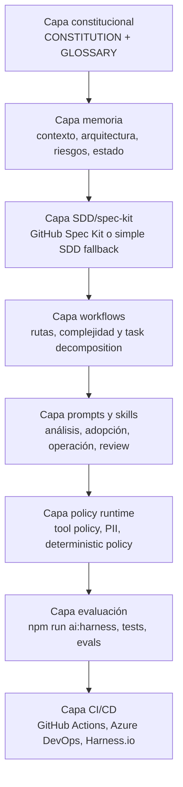
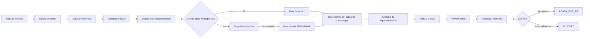
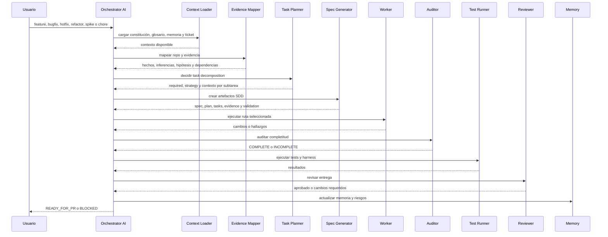
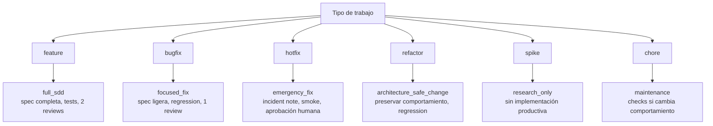
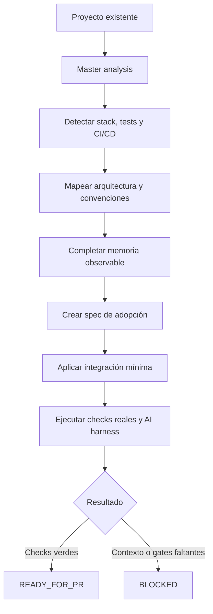
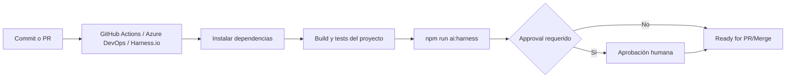
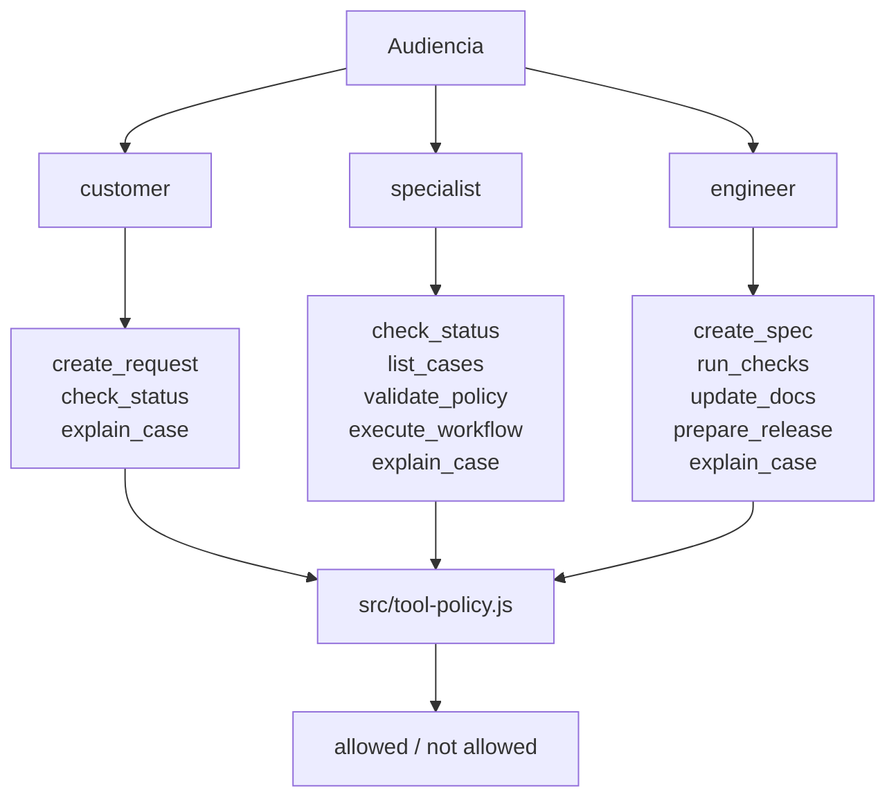
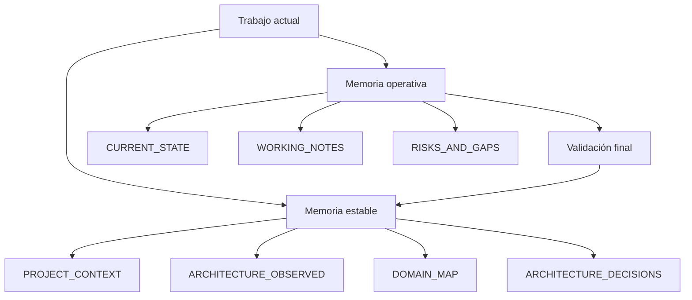
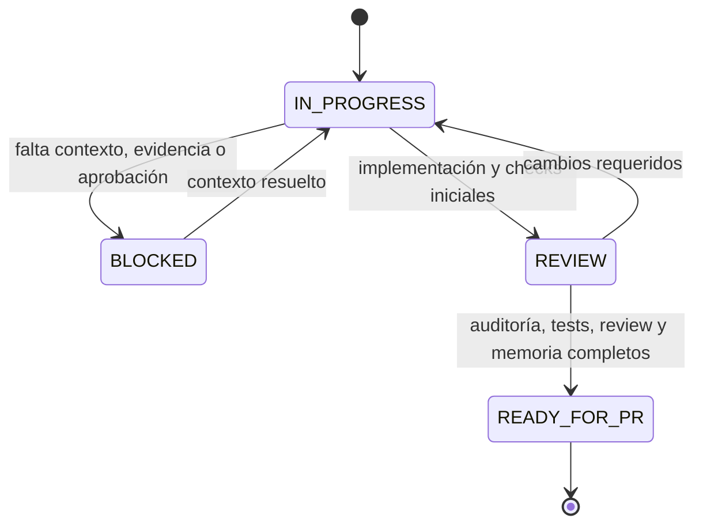

# Template Layers And Diagrams

## Propósito

Este documento explica las capas del AI harness template, por qué existen y para qué fueron generadas. También define los diagramas recomendados para entender, auditar y adoptar el template en proyectos existentes.

La regla central viene de `CONSTITUTION.md`: primero evidencia, después diseño; primero agente principal, después subagentes solo cuando exista una justificación real.

## Capas del template

### 1. Capa constitucional

**Archivos principales**

- `CONSTITUTION.md`
- `ai-engineering/GLOSSARY.md`

**Por qué existe**

Esta capa evita que cada prompt, agente o pipeline tenga reglas distintas. Centraliza evidencia, límites de autonomía, antipatterns, performance, cobertura de pruebas, memoria y definición de done.

**Para qué fue generada**

- Gobernar todo el trabajo del harness.
- Fijar vocabulario común para humanos, agentes LLM y CI/CD.
- Separar hechos observados, inferencias, hipótesis, dependencias críticas y recomendaciones.
- Reducir falsos positivos de entrega.

### 2. Capa de memoria

**Archivos principales**

- `ai-engineering/memory/PROJECT_CONTEXT.md`
- `ai-engineering/memory/ARCHITECTURE_OBSERVED.md`
- `ai-engineering/memory/DOMAIN_MAP.md`
- `ai-engineering/memory/CURRENT_STATE.md`
- `ai-engineering/memory/ARCHITECTURE_DECISIONS.md`
- `ai-engineering/memory/WORKING_NOTES.md`
- `ai-engineering/memory/RISKS_AND_GAPS.md`

**Por qué existe**

Los agentes necesitan contexto persistente, pero ese contexto debe ser verificable y mantenerse separado del prompt temporal. La memoria reduce repetición, alinea decisiones y registra riesgos.

**Para qué fue generada**

- Guardar propósito, arquitectura observada, dominios, decisiones y riesgos.
- Registrar estado vivo del trabajo.
- Evitar que cada análisis empiece desde cero.
- Dejar trazabilidad de cambios relevantes.

### 3. Capa SDD/spec-kit

**Archivos principales**

- `ai-engineering/specs/`
- `ai-engineering/spec-kit/`
- `ai-engineering/templates/spec-template.md`
- `ai-engineering/templates/jira-sdd-spec-template.md`
- `ai-engineering/templates/checklist-template.md`

**Por qué existe**

Los cambios importantes necesitan pasar por una definición explícita de problema, evidencia, plan, tareas y validación antes de implementarse.

**Para qué fue generada**

- Convertir tickets o prompts mínimos en trabajo verificable.
- Separar requisitos, plan, tareas, evidencia y validación.
- Preferir GitHub Spec Kit cuando `specify` y `.specify` estén disponibles.
- Usar el SDD simple local cuando GitHub Spec Kit no esté disponible o el usuario no lo instale.
- Hacer visible el impacto de arquitectura, tests, performance y rollback.

### 4. Capa de workflows

**Archivos principales**

- `ai-engineering/workflows/SDLC_AI_WORKFLOW.md`
- `ai-engineering/workflows/workflow-routes.json`
- `src/workflow-router.js`

**Por qué existe**

No todos los trabajos requieren el mismo proceso. Un hotfix, una feature y un spike tienen riesgos y gates distintos.

**Para qué fue generada**

- Clasificar trabajos como `feature`, `bugfix`, `hotfix`, `refactor`, `spike` o `chore`.
- Seleccionar la ruta correcta.
- Decidir si el trabajo requiere task decomposition antes de implementar.
- Definir artefactos, tests, revisiones y aprobaciones.
- Mantener el modo default como agente principal único.

### 5. Capa de prompts y skills

**Archivos principales**

- `prompts/MASTER_ANALYSIS.md`
- `prompts/ADOPT_EXISTING_PROJECT.md`
- `prompts/ORCHESTRATOR_WORKFLOW.md`
- `prompts/IMPLEMENTATION_GUARDRAILS.md`
- `prompts/REVIEW_CHECKLIST.md`
- `prompts/harness-operator.md`
- `prompts/software-agent.md`
- `skills/`

**Por qué existe**

Los prompts definen cómo debe actuar el agente en cada fase. Las skills empaquetan instrucciones reutilizables para tareas especializadas.

**Para qué fue generada**

- Analizar codebases existentes.
- Adaptar el harness a proyectos brownfield.
- Operar tickets hasta `READY_FOR_PR`.
- Guiar implementación, revisión y operación CI/CD.
- Evitar que la lógica crítica viva solo en lenguaje natural.

### 6. Capa de policy runtime

**Archivos principales**

- `src/tool-policy.js`
- `src/deterministic-policy.js`
- `src/pii.js`
- `src/workflow-router.js`
- `src/spec-kit-router.js`
- `src/harness-decision.js`

**Por qué existe**

Las reglas críticas deben poder validarse de forma determinística. El prompt puede orientar, pero no debe ser la única barrera para permisos, PII, rutas o decisiones críticas.

**Para qué fue generada**

- Definir tools permitidas por audiencia.
- Validar políticas determinísticas.
- Enmascarar PII.
- Resolver rutas de workflow desde configuración versionada.
- Resolver provider de specs entre `github_spec_kit` y `simple_sdd`.
- Componer una decisión única del harness antes de implementar.

### 7. Capa de evaluación y checks

**Archivos principales**

- `tests/`
- `scripts/run-harness.js`
- `package.json`
- `ai-engineering/evals/`

**Por qué existe**

El template necesita una forma rápida de comprobar que sus reglas mínimas siguen vivas después de cambios.

**Para qué fue generada**

- Ejecutar `npm run ai:harness`.
- Validar tool policy, PII, deterministic policy, glosario, constitución, memoria mínima y rutas.
- Servir como gate local y de CI.
- Dar una base para evaluaciones futuras.

### 8. Capa CI/CD y promoción

**Archivos principales**

- `.github/workflows/ai-harness.yml`
- `azure-pipelines.yml`
- `.harness/ai-harness-pipeline.yaml`
- `ai-engineering/observability/tracing.md`

**Por qué existe**

El harness debe integrarse al flujo real de entrega, no quedarse como documentación local. CI/CD permite repetir checks, publicar evidencia y pedir aprobaciones cuando corresponde.

**Para qué fue generada**

- Ejecutar checks en PR o pipeline.
- Integrar GitHub Actions, Azure DevOps y Harness.io.
- Agregar approval gates para escenarios críticos.
- Preparar trazabilidad y observabilidad.

### 9. Capa de perfiles por stack

**Archivos principales**

- `ai-engineering/profiles/dotnet.md`

**Por qué existe**

Un harness genérico no alcanza para todos los stacks. Cada plataforma tiene comandos, riesgos, convenciones y gates propios.

**Para qué fue generada**

- Detectar soluciones `.NET`.
- Definir comandos de restore, build, test, cobertura y format.
- Alinear Azure DevOps, code review, SOLID pragmático y Clean Architecture pragmática.
- Evitar adaptar el harness con supuestos falsos.

## Diagrama de arquitectura del template

## Diagrama de capas

## Diagrama de flujo SDLC

## Diagrama de secuencia

## Diagrama de rutas por tipo de trabajo

## Diagrama de adopción en proyecto existente

## Diagrama de CI/CD

## Diagrama de tool policy

## Diagrama de memoria

## Diagrama de estados de entrega

## Uso recomendado

Usar este documento para:

- onboarding de nuevos proyectos;
- explicar el template a revisores técnicos;
- justificar por qué existe cada carpeta;
- elegir diagramas para documentación ejecutiva o técnica;
- adaptar el harness a codebases existentes sin inventar arquitectura.
